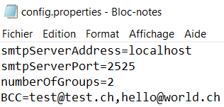
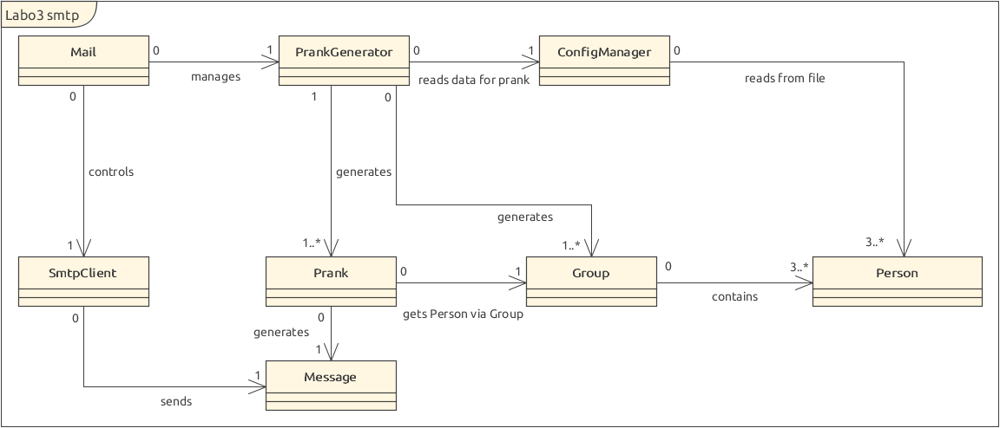
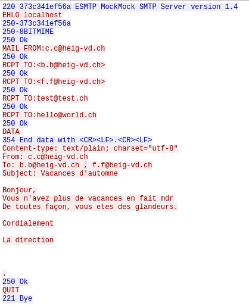

# RES_Labo3_SMTP
Voici le repo du laboratoire 3 sur le protocole SMTP pour le cours RES à l'HEIG-VD.

Auteurs : Besseau Léonard, Ogi Nicolas

Date : 30.04.2021

## Description
Ce logiciel vous permet de faire des farces à vos amis en leur envoyant de faux e-mails. Le repository contient également des instructions pour configurer un faux serveur SMTP (un faux serveur qui simule le comportement d'un serveur de messagerie mais n'envoie pas les messages aux destinataires).

## Instructions d'installation
Après avoir téléchargé la release, décompressez le fichier zip à l'endroit de votre choix. Il vous faut ensuite démarrer le faux serveur SMTP afin qu'il intercepte les farces que vous envoyez.

Pour faire cela, allez dans le dossier *docker*, lancez le script *build-image.sh* (en ayant au préalable démarré Docker) qui va permettre de construire l'image selon le Dockerfile puis lancez le script *run-container.sh* qui va créer un conteneur et directement démarrer le faux serveur SMTP. Il écoute sur le port 8282 (pour HTTP) et le port 25 (pour SMTP) par défaut.

Une fois le serveur démarré, vous pourrez consulter les mails qu'il a reçu en tapant `localhost:8282` dans votre navigateur : 

## Utilisation

1. Pour commencer cette campagne de farces, il vous faut tout d'abord remplir le fichier *config/victimes.utf8* avec les adresses mails des personnes qui en seront victimes :

​	**Attention** : Une adresse mail par ligne.

2. Ensuite, il faut configurer le fichier *config/config.properties*  :

   

   

   - **smtpServerAddress** : correspond à l'adresse du serveur SMTP auquel vous voulez vous connecter. Pour expérimenter le programme avec le faux serveur SMTP MockMock, vous pouvez renseigner `localhost`.
   - **smtpServerPort** : correspond au port sur lequel écoute le serveur SMTP. Utiliser le port 2525 en utilisant le serveur MockMock.
   - **numberOfGroups** : vous permet de renseigner combien de groupes de victimes sont à créer pour votre campagne de farces. Chaque groupe sera composé **au minimum** de **1 expéditeur** et de **2 destinataires** dont les rôles seront attribués aléatoirement au sein du groupe. Le groupe est également composé de victimes choisies aléatoirement parmi la liste des victimes.
   - **BCC** : vous permet d'ajouter une adresse mail qui recevra aussi la farce mais en *cci* (blind copy) afin qu'elle n'apparaisse pas dans le mail. Ceci à des fins de tests ou pour voir discrètement que votre campagne de farce se déroule comme prévu.

   **Attention** : Pour renseigner plusieurs adresses en blind copy, il faut les séparer par des virgules mais **sans espace**.

3. Finalement, il faut écrire vos farces dans le fichier *config/messages.utf8* :

   

**Attention** : Les farces doivent être séparées par **3 underscores** : "___" et le *Subject* doit être renseigné dans le corps du message (voir exemples ci-dessus).

Une fois cela fait, il vous sera normalement possible de lancer le fichier *PrankSender.jar* à l'aide de la commande `java -jar PrankSender.jar` afin de démarrer votre campagne de farces. Une fois que vous avez constaté que votre campagne de farces fonctionne avec le serveur MockMock, vous pouvez alors le remplacer par le serveur SMTP de votre entreprise/école ou de votre FAI mais vos farces pourraient être bloquées selon les règles mises en place. 

## Description de l'implémentation

Pour l'architecture de notre projet, nous nous sommes inspiré des [vidéos d'introduction du labo](https://www.youtube.com/watch?v=OrSdRCt_6YQ). 

- La classe principale est la classe *Mail*, elle s'occupe de relier les différentes parties entre elles afin d'envoyer des farces à vos amis. 
- La classe *SmtpClient* gère l'envoi des farces à un serveur SMTP. 
- Le *ConfigManager* s'occupe de lire les informations dans les fichiers contenus dans le dossier *config* afin de paramétrer votre campagne de farces. 
- Le *PrankGenerator*, quant à lui, s'occupe d'attribuer de façon aléatoire un message à un groupe et de définir ce dernier aléatoirement en fonction du fichier *victims.utf8*.
- Les autres classes permettent de définir les objets *Person*, *Group*, *Prank* et *Message* utilisés dans les classes citées plus haut.

Voici le diagramme UML de notre projet : 

Nous avons effectué plusieurs tests afin de valider le fonctionnement de notre projet, ils se trouvent dans le dossier `src/test/java/ch/heigvd/res/mail`. L'envoi des mails a par contre été testé manuellement et son fonctionnement a été validé en analysant les échanges avec Wireshark. Voici d'ailleurs une capture des messages échangés entre le client et le serveur SMTP :

