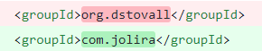
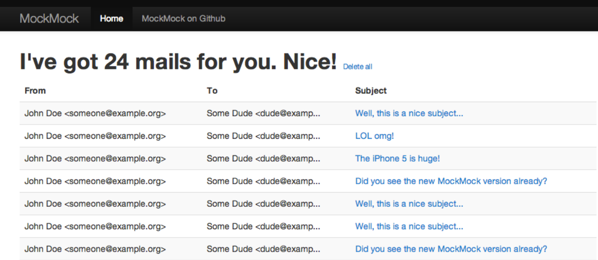
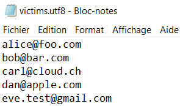
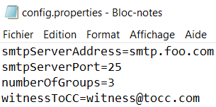
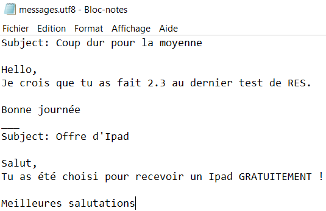

# RES_Labo3_SMTP
Voici le repo du laboratoire 3 sur le protocole SMTP pour le cours RES à l'HEIG-VD.

Auteurs : Besseau Léonard, Ogi Nicolas

Date : 23.04.2021

## Description
Ce programme vous permet de faire des farces à vos amis en leur envoyant de faux e-mails. Il vous permet également de configurer un faux serveur SMTP (un faux serveur qui simule le comportement d'un serveur de messagerie mais n'envoie pas les messages aux destinataires).

## Instructions d'installation
Pour installer le faux serveur SMTP MockMock, il suffit de faire un `git clone` de ce [repo GitHub](https://github.com/tweakers/MockMock) à l'endroit où vous voulez l'installer. Puis de taper la commande `mvn clean install` à l'intérieur du dossier du projet afin de le compiler. 

**Attention** : Dans le fichier *pom.xml* du projet MockMock veuillez faire le changement suivant sinon le projet risque de ne pas compiler : 

Pour plus de détails, consultez cette [pull request](https://github.com/tweakers/MockMock/pull/8).

**TODO** : Expliquer l'installation de MockMock sur un conteneur Docker

Après avoir configuré votre conteneur Docker, il ne vous reste plus qu'à lancer le fichier *MockMock-1.4.0.one-jar.jar* contenu dans le dossier *target*. 

Pour cela vous pouvez simplement taper la commande `java -jar MockMock-1.4.0.one-jar.jar`, cela va démarrer le faux serveur avec les options par défaut (**port SMTP : 25** et **port HTTP : 8282**). 

Sinon pour modifier ces options vous pouvez le faire ainsi : `java -jar MockMock.jar -p 25000 -h 8080` (ici **port SMTP : 25000** et **port HTTP : 8080**)

Une fois le serveur démarré, vous pourrez consulter les mails qu'il a reçu en tapant `localhost:<port>` dans votre navigateur : 

Finalement il vous faudra télécharger la release de ce projet afin de pouvoir l'exécuter une fois les fichiers configurés.

**TODO** : Expliquer le début de l'install avec une release en .jar

## Utilisation

1. Pour commencer cette campagne de farces, il vous faut tout d'abord remplir le fichier *config/victimes.utf8* avec les adresses mails des personnes qui en seront victimes :

​	**Attention** : Une adresse mail par ligne.

2. Ensuite, il faut configurer le fichier *config/config.properties*  :

   

	
	
	- **smtpServerAddress** : correspond à l'adresse du serveur SMTP auquel vous voulez vous connecter. Pour expérimenter le programme avec le faux serveur SMTP MockMock, vous pouvez renseigner `localhost`.
	- **smtpServerPort** : correspond au port sur lequel écoute le serveur SMTP.
	- **numberOfGroups** : vous permet de renseigner combien de groupes de victimes sont à créer pour votre campagne de farces. Chaque groupe sera composé **au minimum** de **1 expéditeur** et de **2 destinataires** dont les rôles seront attribués aléatoirement au sein du groupe. Le groupe est également composé de victimes choisies aléatoirement parmi la liste des victimes.
	- **witnessToCC** : vous permet d'ajouter une adresse mail qui recevra aussi la farce mais en *cci* (blind copy) afin qu'elle n'apparaisse pas dans le mail. Ceci à des fins de tests ou pour voir discrètement que votre campagne de farce se déroule comme prévu.

3. Finalement, il faut écrire vos farces dans le fichier *config/messages.utf8* :

   

**Attention** : Les farces doivent être séparées par **3 underscores** : "___"

Après avoir configuré ces 3 fichiers, vous devriez être capable de lancer votre campagne de farces en exécutant le fichier .jar que vous avez téléchargé au préalable.

## Description de l'implémentation

